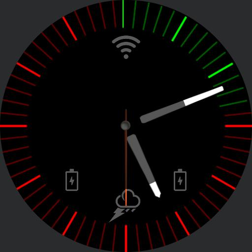

All The Infos  - Watch face for Watchmaker
==========================================

Features
--------

- Steps goal bar (the outer edge of the watch transitions to green as you walk)
- Next Calendar Event (name and countdown time)
- WiFi strength indicator
- Battery indicators (left for watch, right for phone)
- Weather icon

### ToDo:

- Heart beat effect on edge based on actual heart beat
- Time left on current calendar event
- Expose important variables (step goal, toggle heartbeat, etc) at the top of scripts
- General tidy and refactor

How to build
------------

1. Run `build.sh`
2. Import the resulting `watchface.watch` into Watchmaker on Android

Known Issues
------------

- No validator tool. You can't know if you got it right until you import it
  into the application.
- Lua script concatination will break if you forget to add a new line at the
  end of the file.
